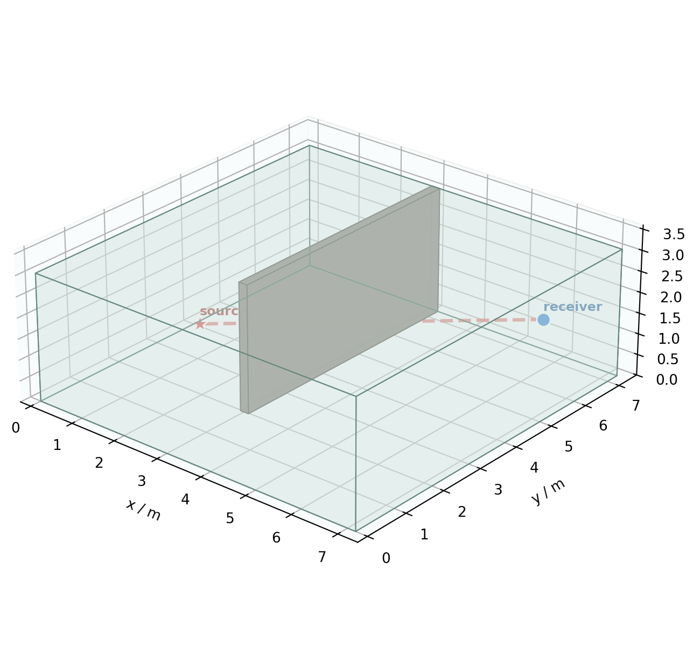
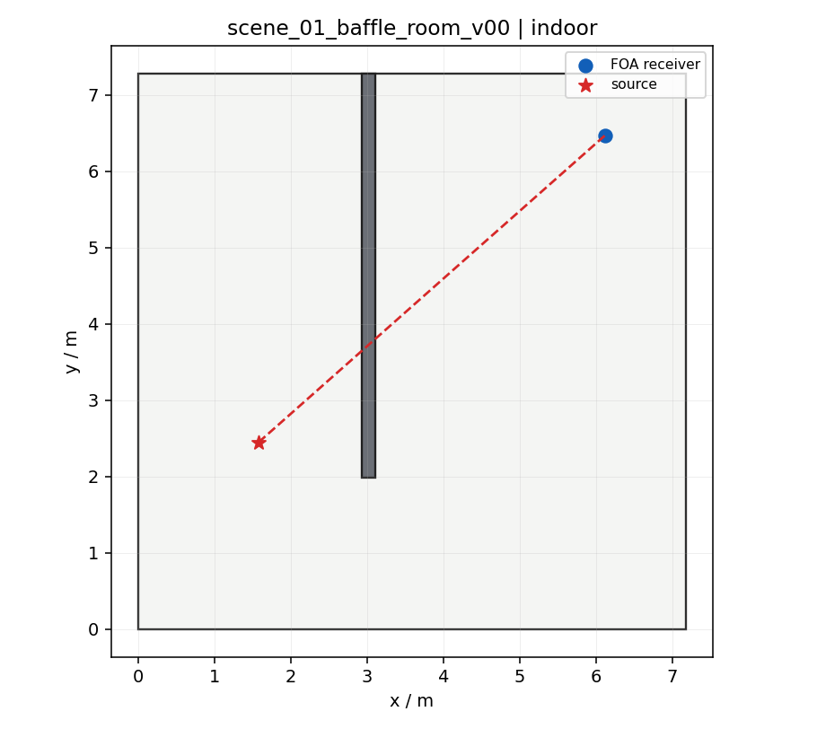
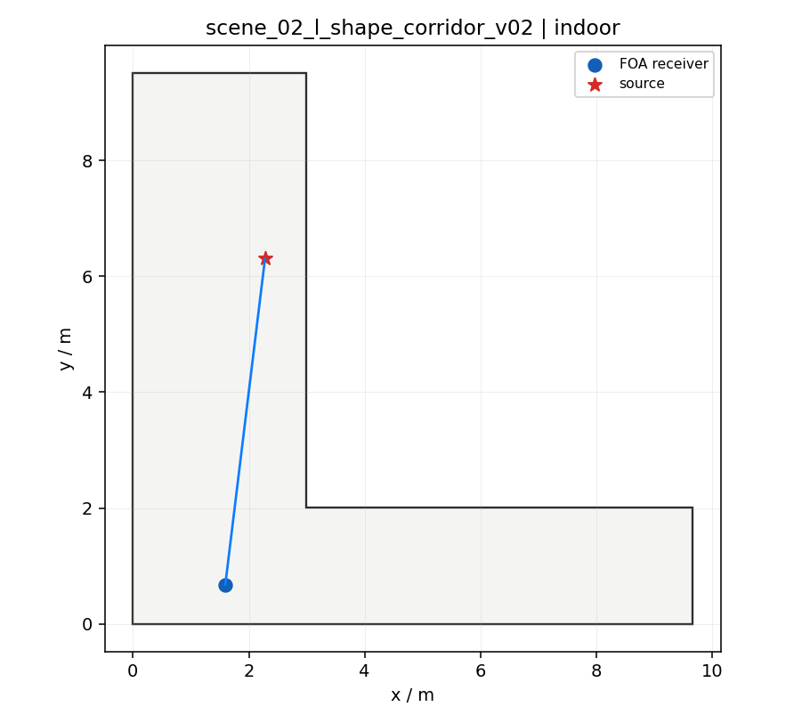
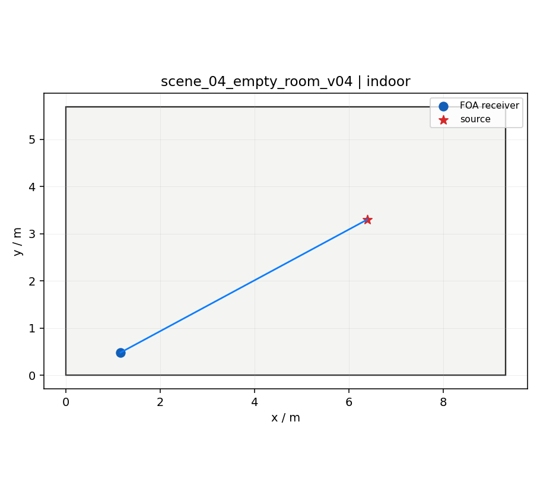
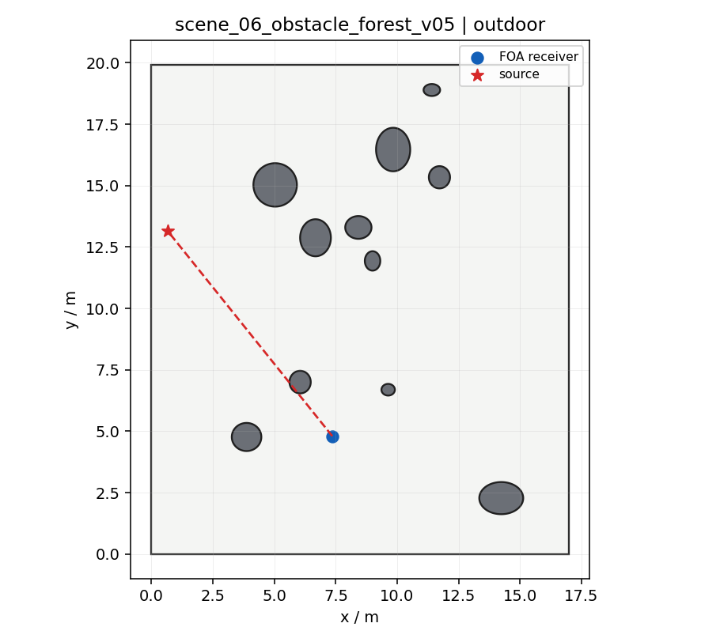

# OCC Data Synth

OCC Data Synth is a SoundSpaces/Habitat-Sim based toolkit for acoustic scene simulation and data synthesis. It exports two complementary workflows:

- Direct audio synthesis: input mono WAV files, render SoundSpaces/Habitat-Sim room impulse responses, then save reverberant/occluded FOA and mono audio.
- Reusable RIR bank generation: pre-render FOA/mono RIR arrays so large audio corpora can be convolved later without repeatedly launching Habitat-Sim.

The project also includes a reproducible 3D scene viewer for checking generated meshes, source/receiver positions, direct paths, and camera footprints.

<p align="center">
  
</p>

## Highlights

- SoundSpaces/Habitat-Sim is the acoustic backend; the legacy geometric code is used for scene generation and visualization, not as a simplified replacement.
- FOA output is exported in ACN/SN3D channel order `[W, Y, Z, X]`.
- The RIR bank path separates expensive acoustic simulation from cheap large-scale convolution.
- The browser viewer loads the generated OBJ scene and checks receiver/source placement before scaling up a run.
- Outdoor/open scenes are exported as finite acoustic domains with strongly absorbing side and top boundaries. `open_field` and `obstacle_forest` therefore contain real `sky_absorber` boundary faces in the OBJ, not only material metadata.

## Acoustic Boundary And Materials

The default workflow uses the official RLR/SoundSpaces-style material database written at runtime as `reports/occ_rlr_materials.json`. Materials are enabled by default through `SoundSpacesConfig.enable_materials=True`; generation scripts pass `audio_materials_json` to the backend unless `--disable-materials` is explicitly set.

Programmatic OBJ scenes are converted to Habitat semantic stages before rendering. The backend writes `.stage_config.json`, `.scn`, and `_semantic.ply` files from OBJ `usemtl` labels, then calls `AudioSensor.setAudioMaterialsJSON(...)` when supported by the local SoundSpaces/Habitat-Sim build.

Outdoor scenes use a finite-domain approximation of open propagation:

- Indoor scenes export floor, wall sides, and ceiling.
- `open_field` exports a grass ground plane plus real side and ceiling faces using `sky_absorber`.
- `obstacle_forest` exports a soil ground plane, real side and ceiling faces using `sky_absorber`, and obstacle geometry using `solid_occluder`.

The fixed mapping is documented in `material_assignment_table.md`. The same mapping is also written at runtime as `reports/occ_scene_material_assignments.json`:

- `baffle_room`: indoor hard floor, reflective wall, reflective ceiling, solid occluder.
- `l_shape_corridor`, `t_shape_corridor`, `empty_room`: indoor hard floor, reflective wall, reflective ceiling.
- `open_field`: `outdoor_ground_grass` floor, `sky_absorber` side boundary, `sky_absorber` ceiling.
- `obstacle_forest`: `outdoor_ground_soil` floor, `sky_absorber` side boundary, `sky_absorber` ceiling, `solid_occluder` obstacles.

A quick end-to-end material check:

```bash
MPLCONFIGDIR=/tmp/occ_mpl NUMBA_DISABLE_JIT=1 PYTHONPATH=src:. conda run --no-capture-output -n occ_env \
  python src/soundspaces_adapter/verify_open_boundaries.py \
  --output-dir outputs/open_boundary_check \
  --render \
  --sample-rate 16000 \
  --ir-duration 0.1
```

The generated outdoor OBJ files should include real face records after `usemtl sky_absorber`, for example:

```text
g boundary_ceiling
usemtl sky_absorber
f ...

g boundary_side
usemtl sky_absorber
f ...
```

## Example Scene Checks

The included figures are generated from the same procedural scene and placement code used by the SoundSpaces/Habitat-Sim runs. Blue marks the FOA receiver, red marks the source, and the line shows the direct acoustic path.

| Baffle room | L-shaped corridor | Empty room | Obstacle forest |
| --- | --- | --- | --- |
|  |  |  |  |

## Repository Layout

```text
configs/                 Example YAML configs
docs/assets/             README figures
examples/test_audio_bank Small ESC-50 real-audio smoke-test manifest
scripts/                 Public command-line entry points
src/legacy_geometric/    Programmatic scene geometry, sampling, plots
src/soundspaces_adapter/ SoundSpaces/Habitat-Sim adapter and validation
src/rir_bank/            RIR manifest, metrics, and validation helpers
viewer3d/                Browser-based Three.js scene viewer
```

Generated outputs are written under `outputs/` by default and are ignored by git.

## Environment

The verified local environment is `/home/digao/miniconda3/envs/occ_env` with Python 3.10, `habitat-sim==0.2.2`, `habitat==0.2.2`, `sound-spaces==0.1.1`, and CUDA 11.8 PyTorch.

To create a similar base environment:

```bash
conda env create -f environment.yml
conda activate occ_env
```

Then install the SoundSpaces/Habitat stack following the SoundSpaces 2.0 audio branch instructions. These packages are version-sensitive and may require source/editable installs; keep the versions above when reproducing the tested setup.

For the viewer:

```bash
cd viewer3d
npm install
```

## Data Paths

All public scripts accept a YAML config:

```bash
python scripts/synthesize_audio.py --config configs/audio_synthesis.yaml
```

Paths inside configs are resolved relative to the config file. You can override scalar values without editing YAML:

```bash
python scripts/generate_rirs.py --config configs/rir_generation.yaml --set num_rirs=10
```

Audio manifests may be CSV/TSV/JSON. CSV rows should contain at least `path,label,audio_id`; relative audio paths are resolved against the manifest file.

## Direct Audio Synthesis

Smoke-test command using the default material chain:

```bash
MPLCONFIGDIR=/tmp/occ_mpl NUMBA_DISABLE_JIT=1 conda run --no-capture-output -n occ_env \
  python scripts/synthesize_audio.py \
  --config configs/audio_synthesis.yaml \
  --set enable_materials=true
```

Direct command for a fire-sound manifest:

```bash
MPLCONFIGDIR=/tmp/occ_mpl NUMBA_DISABLE_JIT=1 PYTHONPATH=src:. conda run --no-capture-output -n occ_env \
  python src/soundspaces_adapter/build_dataset.py \
  --output-dir outputs/fire_audio_dataset \
  --audio-manifest /path/to/your/fire_audio_manifest.csv \
  --source-dataset-name fire_sound_dataset_v2 \
  --variants-per-type 10 \
  --num-examples 1000 \
  --scene-sampling random \
  --audio-sampling cover_once_then_random \
  --sample-rate 16000 \
  --duration source \
  --ir-duration 0.2 \
  --ray-count 1000 \
  --thread-count 1 \
  --no-progress-bar
```

Main outputs:

- `audio/*_foa.wav`: FOA audio, ACN/SN3D channel order `[W, Y, Z, X]`.
- `audio/*_mono.wav`: mono derived from FOA W as `W * sqrt(2)`.
- `labels/*.json`: source/receiver positions, occlusion metadata, render config.
- `geometry/*.obj`: generated Habitat mesh.
- `figures/*_layout.png`: top-down scene check.

Increase `num_examples`, `variants_per_type`, and ray counts in `configs/audio_synthesis.yaml` for medium-scale generation. Do not pass `--disable-materials` for material-correct synthesis.

## RIR And Single-Impulse Analysis

For propagation analysis, render or reuse a RIR bank and then analyze a 10-second single-impulse probe:

```bash
PYTHONPATH=src python src/soundspaces_adapter/analyze_rir_impulse_probe.py \
  --input-dir outputs/flat_spectrum_probe_10s_open_boundary \
  --output-dir outputs/rir_impulse_analysis_open_boundary \
  --sample-rate 16000 --duration 10 --impulse-time 0.5
```

The script writes per-case RIR metrics, impulse-output WAV files, RIR energy decay plots, impulse waveform plots, and scene-type summaries. The impulse is placed inside the first second so propagation delay and tail energy can be inspected cleanly.

## Batch RIR Generation

Smoke-test command using the default material chain:

```bash
MPLCONFIGDIR=/tmp/occ_mpl NUMBA_DISABLE_JIT=1 conda run --no-capture-output -n occ_env \
  python scripts/generate_rirs.py \
  --config configs/rir_generation.yaml \
  --set enable_materials=true
```

Direct command for a reusable RIR bank:

```bash
MPLCONFIGDIR=/tmp/occ_mpl NUMBA_DISABLE_JIT=1 PYTHONPATH=src:. conda run --no-capture-output -n occ_env \
  python src/run_rir_bank.py \
  --output-dir outputs/fire_occ_rir_bank \
  --scenarios 60 \
  --rirs-per-scenario 20 \
  --scene-sampling stratified \
  --sample-rate 16000 \
  --ir-duration 0.2 \
  --direct-ray-count 500 \
  --indirect-ray-count 1000 \
  --rir-format both \
  --compute-metrics \
  --seed 42
```

Main outputs:

- `rirs/scene_*/rir_*_foa.npy`: FOA RIR shaped `[4, T]`.
- `rirs/scene_*/rir_*_mono.npy`: mono RIR derived from FOA W.
- `rir_manifest.csv` and `rir_manifest.jsonl`: reusable metadata for later convolution.
- `reports/verification_report.json`: shape and value validation.

The RIR workflow is intentionally independent of dry-audio convolution, so the saved `.npy` files can be reused with large external audio datasets.

## 3D Scene Visualization

Generate viewer assets:

```bash
PYTHONPATH=src python scripts/visualize_scene.py --config configs/visualization.yaml
```

This writes OBJ/MTL geometry and `viewer3d/data/latest_report.json`. Start the viewer:

```bash
cd viewer3d
npm run serve
```

Open `http://127.0.0.1:8765/`. The viewer shows the 3D mesh, receiver, source, direct path, and camera footprint. Set `render_habitat_rgb: true` in `configs/visualization.yaml` to also request Habitat RGB/depth observations when the local Habitat renderer is available.

## License

The project code is released under the repository license.

## Common Issues

- `habitat_sim is not importable`: install the SoundSpaces/Habitat-Sim stack in the active conda environment.
- Native crash on simulator construction: confirm the SoundSpaces audio branch and Habitat-Sim versions match the verified stack.
- Empty or invalid RIR: try larger `indirect_ray_count`, check the exported OBJ in `viewer3d`, and inspect `reports/invalid_rirs.csv`.
- Viewer cannot load `three`: run `npm install` inside `viewer3d`.
- Viewer cannot load mesh: regenerate assets with `scripts/visualize_scene.py` and serve from `viewer3d`, not by opening the HTML file directly.
